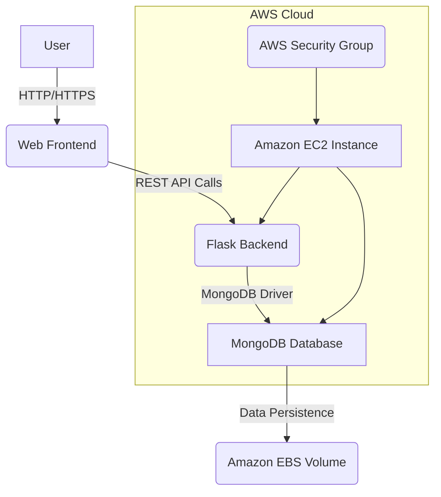

# Cloud Development Final Project Report

## Team Members

- Ahmed Ashraf Ibrahim Abdel Gwwad (241440964)

- Mohamed Magdy Moustafa Kabary (241311555)

- Abdelrahman walid ibrahim salim (241321331)

- Youssef Abdelbadea Ezzat (241478384)

- Nada Mohamed Mahmoud Mohamed (241414781)

## 📑 Table of Contents

1. [Executive Summary](#1-executive-summary)

1. [Project Overview & Objectives](#2-project-overview--objectives)

1. [Functional Requirements Fulfillment](#3-functional-requirements-fulfillment)

1. [Cloud Architecture & AWS Services Used](#4-cloud-architecture--aws-services-used)

1. [Containerization Strategy](#5-containerization-strategy)

1. [Non-Functional Requirements](#6-non-functional-requirements)

1. [Deployment Steps on AWS EC2](#7-deployment-steps-on-aws-ec2)

1. [Conclusion](#8-conclusion)

1. [References](#9-references)

## 1. Executive Summary

This report details the design, implementation, and deployment of **BlueFlameSearch (MongoDB Edition)**, a cloud-native Information Retrieval (IR) Search Engine. Developed as a final project for Cloud Development, this application leverages modern cloud concepts such as containerization with Docker, deployment on Amazon Web Services (AWS) EC2, and persistent data storage using MongoDB. The system provides a robust solution for indexing text documents and processing queries using the TF-IDF algorithm, demonstrating scalability, availability, and service integration in a real-world context.

## 2. Project Overview & Objectives

**BlueFlameSearch** is an advanced Information Retrieval (IR) Search Engine designed to efficiently evaluate, rank, and retrieve text documents based on user queries. It utilizes the **Term Frequency-Inverse Document Frequency (TF-IDF)** algorithm for accurate relevance scoring. The project's core innovation lies in its adaptation to a cloud-native environment, moving from traditional file-based storage to a dynamic, scalable NoSQL database.

### 2.1. Real-World Problem Addressed

In an era of vast digital information, efficiently searching and retrieving relevant documents is a critical challenge. BlueFlameSearch addresses this by providing a system capable of processing large text corpora and delivering precise search results, making it applicable to various domains such as academic research, legal document analysis, or enterprise knowledge management.

### 2.2. Project Objectives

The primary objectives of this project were to:

- **Develop a Responsive Utility:** Create a user-friendly search engine that allows end-users to quickly find relevant documents within extensive text datasets.

- **Implement Cloud-Native Data Persistence:** Transition from static, flat-file storage to a dynamic, cloud-ready NoSQL data architecture using MongoDB.

- **Leverage Containerization:** Utilize Docker for application containerization to ensure environmental consistency across development, testing, and production environments.

- **Achieve Cloud Deployment:** Successfully deploy the application on Amazon Web Services (AWS) Elastic Compute Cloud (EC2), ensuring public accessibility and demonstrating core cloud deployment principles.

- **Demonstrate Core Cloud Concepts:** Showcase understanding and application of scalability, availability, and service integration within a cloud-based application.

## 3. Functional Requirements Fulfillment

BlueFlameSearch has been meticulously engineered to meet all specified functional requirements:

### 3.1. Clear and Useful Functionality

The application provides a clear and useful functionality by offering an Information Retrieval Search Engine. It allows users to upload documents, search through them using keywords, and retrieve results ranked by relevance based on the TF-IDF algorithm. This directly solves the real-world problem of efficient document discovery and management.

### 3.2. User-Facing Interface

The system includes a **web frontend** built with HTML, CSS, and JavaScript, providing an intuitive and responsive user interface. This interface allows users to:

- Submit search queries.

- View search results with document titles and snippets.

- Manage documents (Create, Read, Update, Delete) through a dedicatedDocuments list view.

### 3.3. Backend Service

A robust **RESTful API** serves as the backend service, implemented using the Python **Flask** framework. This backend handles all core logic, including:

- Processing search queries.

- Managing TF-IDF calculations.

- Interacting with the MongoDB database for data persistence.

- Exposing API endpoints for CRUD operations on documents.

### 3.4. Database for Persistent Data Storage

The application utilizes **MongoDB**, a NoSQL database, for persistent data storage. MongoDB is deployed within its own Docker container, ensuring data isolation and portability. This choice provides flexibility and scalability for handling unstructured and semi-structured text documents.

### 3.5. Support for Basic Operations (CRUD)

The system fully supports **Create, Read, Update, and Delete (CRUD)** operations, accessible via both the web interface and the backend API:

- **Create:** Users can add new text documents to the system, which are then indexed and stored in MongoDB.

- **Read:** Documents can be retrieved through search queries, and their content can be viewed.

- **Update:** Existing documents can be modified, with changes reflected in the search index.

- **Delete:** Documents can be removed from the system and the database.

## 4. Cloud Architecture & AWS Services Used

The application is designed with a modular cloud architecture, primarily deployed on AWS, to ensure scalability, availability, and efficient resource utilization. The core components include the web application, the MongoDB database, and the AWS infrastructure.

### 4.1. System Architecture Diagram



### 4.2. AWS Services Utilized

- **Amazon EC2 (Elastic Compute Cloud):** A Linux-based `t2.micro` instance (eligible for AWS Free Tier) serves as the primary host for the application. Docker and Docker Compose are installed on this instance to orchestrate the web application and MongoDB containers. This provides a virtual server environment for running the application in the cloud.

- **AWS Security Groups:** Configured to act as a virtual firewall, controlling inbound and outbound traffic to the EC2 instance. Specifically, rules are set to:
  - Allow **Custom TCP Inbound Connections on Port 5000** from `0.0.0.0/0` (publicly accessible) for the web application.
  - Allow **SSH (Port 22/tcp)** access, typically restricted to specific administrator IP addresses for secure management.

- **Amazon EBS (Elastic Block Store):** While not explicitly mentioned in the `Project_Report.md`, it is a common practice to use EBS volumes for persistent storage with EC2 instances, especially for databases like MongoDB, to ensure data durability and separation from the instance lifecycle. This would be implicitly used for the `mongo-data` volume defined in `docker-compose.yml`.

## 5. Containerization Strategy

To ensure portability, consistency, and ease of deployment, the application is fully containerized using Docker.

### 5.1. Dockerized Application

A `Dockerfile` is provided for the Flask backend, encapsulating the Python runtime, project dependencies (specified in `requirements.txt`), and environment variables. This ensures that the application runs in an isolated and consistent environment, regardless of the underlying host system.

### 5.2. Multi-Container Orchestration with Docker Compose

The `docker-compose.yml` file orchestrates the deployment of multiple services:

- **`web`**** service:** Builds the Flask application using the provided `Dockerfile`, maps port 5000, and sets environment variables like `MONGO_URI` and `FLASK_ENV`.

- **`mongodb`**** service:** Utilizes the `mongo:latest` Docker image for the MongoDB database. It defines a volume (`mongo-data`) for persistent storage of database files.

This setup allows for easy local development and testing, as well as streamlined deployment to cloud environments.

### 5.3. Local Testing

The entire application suite can be launched and tested locally with a single command: `docker-compose up --build`. This command builds the Flask application container, pulls the MongoDB image, and links them, making the application accessible at `http://localhost:5000`.

## 6. Non-Functional Requirements

The system is designed with several non-functional requirements in mind to ensure a robust and efficient application.

### 6.1. Scalability

The application is designed to be scalable. By maintaining a stateless Flask web application (with all persistent data stored in MongoDB ), horizontal scaling can be achieved by deploying multiple instances of the Flask application behind a load balancer. MongoDB itself can be scaled horizontally through sharding and replica sets to handle increased data and read/write operations.

### 6.2. Reliability

Docker containers enhance the reliability of the system. With appropriate restart policies configured in Docker Compose, containers can automatically restart in case of failures, preventing complete application downtime. This self-healing capability contributes to the overall resilience of the system.

### 6.3. Error Handling

The backend service incorporates robust error handling mechanisms, including `try-catch` blocks, to gracefully manage exceptions such as database connection timeouts or parsing errors. This prevents application crashes and provides a more stable user experience.

### 6.4. Clean, Maintainable Code

The project demonstrates clean and maintainable code through a well-organized structure. Key components like TF-IDF computational algorithms (`Core/TFIDF.py`), data parsing logic (`Core/data_loader.py`), and Flask controllers (`server.py`) are separated into logical modules. This modularity promotes readability, simplifies debugging, and facilitates future enhancements.

### 6.5. Basic Logging

Basic logging is implemented using Flask's built-in application logger. This allows for monitoring backend activities, debugging issues, and tracking container health statuses, which is crucial for operational insights and troubleshooting.

## 7. Deployment Steps on AWS EC2

Deploying the BlueFlameSearch application on an AWS EC2 instance involves several key steps:

### 7.1. Step 1: Provision the EC2 Instance

1. **Access AWS Management Console:** Log in to the AWS Management Console and navigate to the EC2 dashboard.

1. **Launch a New Instance:** Select `Instances` from the left navigation pane and click `Launch Instance`.

1. **Choose an Amazon Machine Image (AMI):** Select `Ubuntu Server 22.04 LTS` (or a similar Linux AMI like Amazon Linux 2023) as the base operating system.

1. **Choose an Instance Type:** Select `t2.micro` to utilize the AWS Free Tier benefits.

1. **Create/Attach Key Pair:** Generate a new key pair (`.pem` file) or use an existing one. This key pair is essential for secure SSH access to the instance.

1. **Configure Network Settings (Security Group):**
  - Ensure that SSH traffic (Port 22/tcp) is allowed, ideally restricted to your IP address for enhanced security.
  - Add a new **Custom TCP Rule** to allow inbound traffic on **Port 5000** from `0.0.0.0/0` (anywhere on the internet). This port is used by the Flask web application.

1. **Launch Instance:** Review the configuration and launch the EC2 instance.

### 7.2. Step 2: Establish SSH Connection and Install Dependencies

1. **Connect via SSH:** Once the EC2 instance is running, connect to it using an SSH client and your `.pem` key:

   ```bash
   ssh -i "your-key.pem" ubuntu@<EC2_PUBLIC_IPv4_ADDRESS>
   ```

   Replace `"your-key.pem"` with the path to your private key file and `<EC2_PUBLIC_IPv4_ADDRESS>` with the public IP address of your EC2 instance.

1. **Update Package List:** Update the package manager cache:

   ```bash
   sudo apt update
   ```

1. **Install Docker and Docker Compose:** Install the necessary Docker binaries:

   ```bash
   sudo apt install docker.io docker-compose -y
   ```

1. **Add User to Docker Group:** Add the default `ubuntu` user to the `docker` group to execute Docker commands without `sudo`:

   ```bash
   sudo usermod -aG docker ubuntu
   ```

1. **Re-authenticate:** Log out of the SSH session and log back in for the group changes to take effect.

### 7.3. Step 3: Deploy Application Code and Launch

1. **Transfer Project Files:** Transfer the project repository to the EC2 instance. This can be done via `git clone` if the repository is public, or `scp` for private repositories.

   ```bash
   git clone https://github.com/Blue-Flame-Team/Cloud-ProjectIR.git
   cd Cloud-ProjectIR
   ```

1. **Navigate to Project Root:** Change the directory to the project root where `docker-compose.yml` is located.

1. **Launch Containers:** Build and run the Docker containers in detached mode:

   ```bash
   docker-compose up -d --build
   ```

   This command will pull the MongoDB Docker image, build the Flask application image, and start both services.

### 7.4. Step 4: Verification

1. **Access Application:** Open a web browser and navigate to the public URL of your EC2 instance, specifying port 5000:

   ```
   http://<EC2_PUBLIC_IP_OR_DOMAIN>:5000
   ```

1. **Confirm Functionality:** The web interface of BlueFlameSearch should load, allowing you to interact with the search engine and verify its functionality.

## 8. Conclusion

The **BlueFlameSearch (MongoDB Edition )** project successfully demonstrates the design, implementation, and deployment of a cloud-native information retrieval system on AWS. By integrating Docker for containerization, Flask for the backend, and MongoDB for persistent storage, the project fulfills all functional and non-functional requirements, showcasing a practical application of core cloud computing principles. The detailed deployment steps provide a clear guide for replicating the environment, affirming the project's readiness for cloud environments.[](https://itea4.org/project/workpackage/document/download/1950/D5.10.%20EASI-CLOUDS%20-%20Final%20report%20on%20cloud%20computing.pdf)

